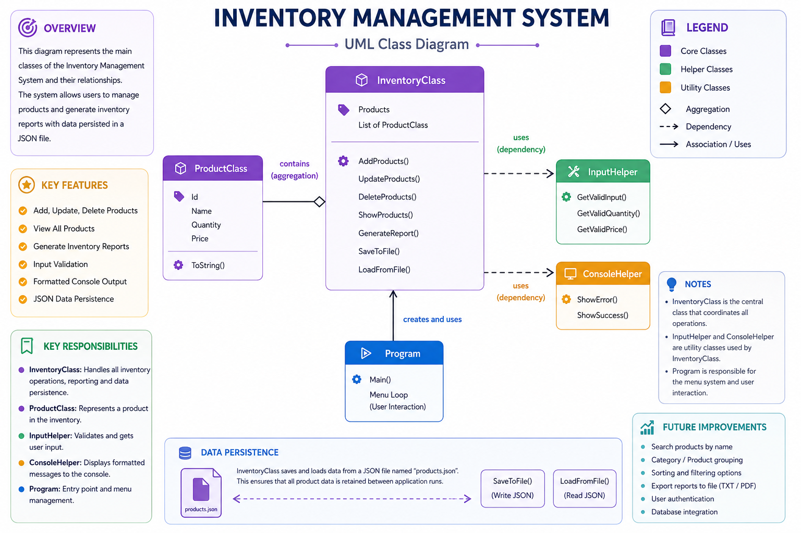

# Inventory Management System

## Project Overview

This is a C# Console Application developed for managing inventory in a small business environment.

The application allows users to:

* Add products
* Update products
* Delete products
* View all products
* Generate inventory reports

The project was built using Object-Oriented Programming (OOP) principles and includes:

* LINQ
* JSON file handling
* reusable helper classes
* console UI formatting
* input validation

---

# Features

## Product Management

* Add new products
* Update products
* Delete products
* View all products

---

## Inventory Reporting

* Calculate total inventory value
* Display most expensive product
* Display cheapest product
* Display low stock products

---

## Input Validation

* Prevent duplicate product IDs
* Validate numeric inputs
* Prevent negative values
* Handle empty inputs

---

## JSON Persistence

* Save products into a `products.json` file
* Automatically load products when the application starts

---

# UML Diagram

## System Architecture

The following UML diagram shows the structure and relationships between the classes used in the project.

---

# Technologies Used

* C#
* .NET Console Application
* Object-Oriented Programming (OOP)
* LINQ
* JSON Serialization
* File Handling

---

# Project Structure

## ProductClass

Represents a single product in the inventory.

### Properties

* Id
* Name
* Quantity
* Price

### Methods

* ToString()

---

## InventoryClass

Handles inventory operations and business logic.

### Main Responsibilities

* Add products
* Update products
* Delete products
* Generate reports
* Save/load JSON data

### Methods

* AddProducts()
* UpdateProducts()
* DeleteProducts()
* ShowProducts()
* GenerateReport()
* SaveToFile()
* LoadFromFile()

---

## InputHelper

Contains reusable validation methods.

### Methods

* GetValidInput()
* GetValidQuantity()
* GetValidPrice()

---

## ConsoleHelper

Handles reusable colored console messages.

### Methods

* ShowError()
* ShowSuccess()

---

## Program.cs

Contains:

* Menu system
* Application flow
* User interaction

---

# JSON File Handling

The application uses JSON serialization to store product data permanently.

Products are saved into:

products.json

The application automatically:

* saves data after modifications
* loads data when the program starts

---

# LINQ Usage

The project uses LINQ methods such as:

* Any()
* FirstOrDefault()
* Where()
* OrderBy()
* OrderByDescending()
* Sum()

---

# How To Run The Project

1. Open the solution in Visual Studio
2. Build the project
3. Run the application
4. Use the console menu to manage inventory

---

# Console Menu

[1] Add Product
[2] Update Product
[3] Delete Product
[4] View Products
[5] Generate Report
[6] Exit
